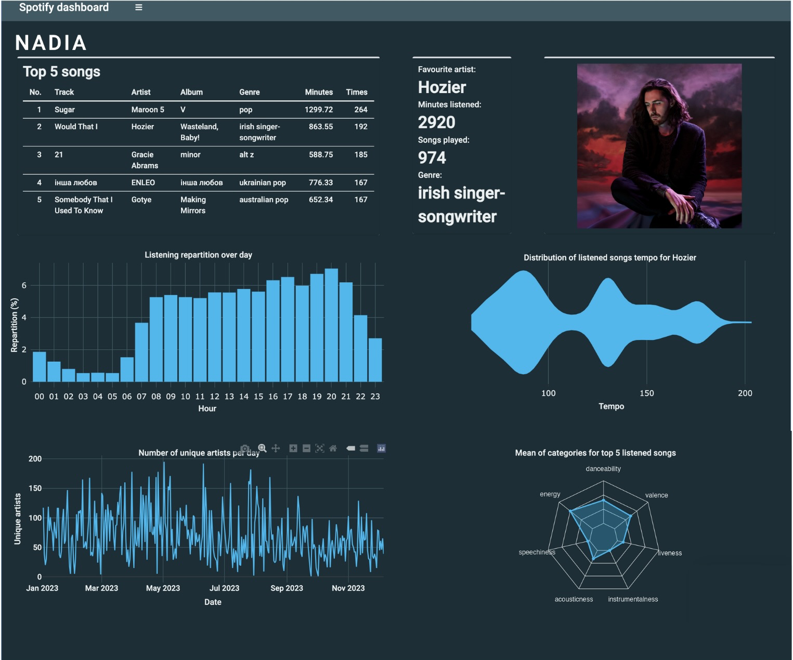
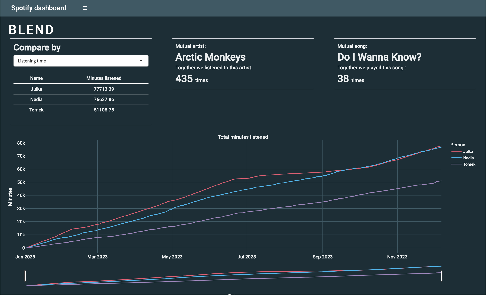
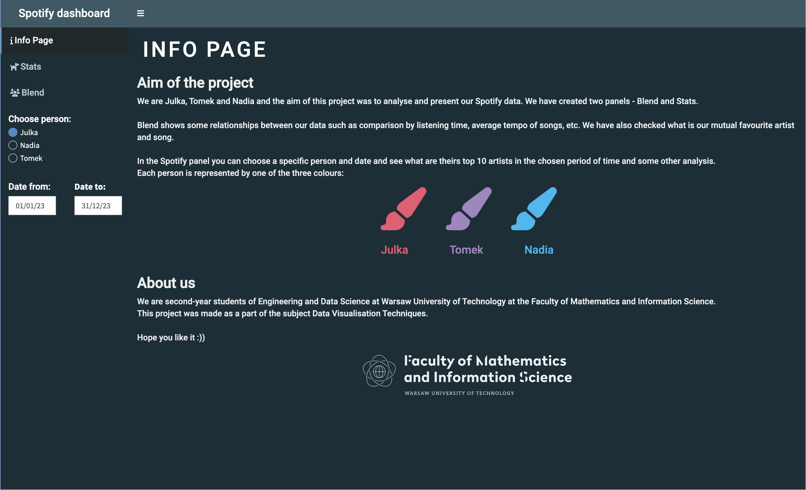

# Spotify - a data analysis
*Authors: [Julia Kruk](https://github.com/krukj), [Nadia Serafin](https://github.com/nadias03) & [Tomasz Żywicki](https://github.com/tomaszzywicki)*
## About the project
The goal of this Shiny App was to analyze and visualize data from our Spotify accounts. In the "Blend" panel, we compared various statistics such as listening time, average tempo of songs, and more. Additionally, we designed a "Stats" panel to showcase personal data for each user. This panel includes information about our top 5 songs, favourite artist, and plots that visualize the distribution of listening times throughout the day, changes in the number of unique artists per day, distribution of tempo for our favourite artist's songs, and average characteristics of top songs. Each panel's data can be filtered by time.
  
  Results can be see seen [here](https://drimtim.shinyapps.io/SpotifyDashboard/).
## Used technologies 
- programming language: **R** (and some **CSS**)
- libraries used:
  - data analysis: **dplyr**, **tidyr**
  - data visualisation: **shiny**, **ggplot**
## Preview

*The project was made for the Data Visualization Techniques course during the 3rd semester of the Data Science program at the Faculty of Mathematics and Information Systems, Warsaw University of Technology. Course coordinator: [Anna Kozak](https://github.com/kozaka93).*
